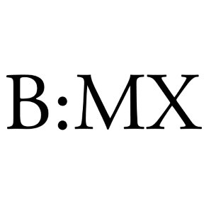

# BECAS:MX

## Ironhack Module 3 MERN Full-stack Application
By Mariana Gamiño

## About :smiley:

BECAS:MX es un portal en el que monitoreamos medios de comunicación para colectar convocatorias de becas, premios, concursos y oportunidades para cualquier persona que desee superarse. Aquí se puede encontrar información relevante para acceder a un desarrollo profesional más amplio de acuerdo al perfil y aspiraciones de cada quién.

##Test App
Puedes acceder a la página hacinedo click [aquí](https://becasmx.netlify.com/)

Si quieres acceder a los permisos de administrador, entra con la siguiente cuenta:

usuario: Mariana 
contraseña: 123

Siendo administrador, puedes crear becas, premios y concursos desde tu perfil o editar y borrarlos en la vista detallada de cada uno.

Por otro lado, para ver el portal como lo vería cualquier otro usuario, te invito a crearte una cuenta. Puedes personalizar tu perfil cambiando tu imagen.

### Log in y Sign up

Esta página utiliza passport para encriptar contraseñas y autenticar y authorizar usuarios.

## Acknowledgments

Thanks to our TA's and lead teachers for all their patience and help :) :heart:
